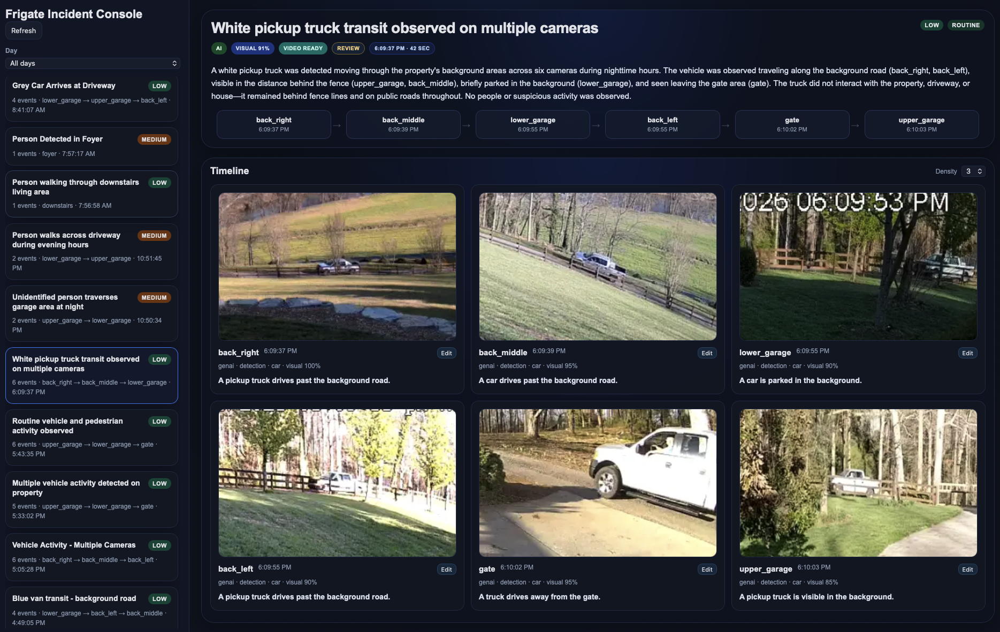

# 📡 Frigate Signal — Incident Correlation & Video Synthesis Engine

Frigate Signal is a local-first incident intelligence layer that sits on top of Frigate NVR. It ingests object detection events, correlates them into meaningful “incidents,” enriches them with AI, validates them visually, and generates stitched timeline videos.

This is not just event logging — it’s **context-aware incident reconstruction**.

---

# 🧠 System Overview

Frigate → MQTT (frigate/reviews)
        → Event ingestion
        → Incident correlation engine
        → AI enrichment (LLM)
        → Visual validation
        → Video synthesis (FFmpeg)
        → Web UI (Incident Console)

---

# 🔑 Core Concepts

## 1. Events
Raw detections from Frigate:
- camera
- timestamp
- label (person, car, dog, etc.)
- bounding box + confidence
- thumbnail + review URL

---

## 2. Incidents
Events are grouped into **incidents** based on:

- time proximity (incident_window_seconds)
- camera adjacency (camera_topology.json)
- movement continuity

Example:
Driveway → Garage → Backyard

Becomes a single incident instead of 3 unrelated events.

---

## 3. AI Enrichment

Each incident is analyzed by an LLM to produce:

- title_ai
- summary_ai
- scene_ai
- behavior
- severity

---

## 4. Visual Validation

Before finalizing the incident:

- Key frames are sampled
- Sent to vision model
- Confidence score generated
- False positives filtered

---

# 🎬 Video Generation (FFmpeg Pipeline)

This is the most important part of the system.

---

# 🔗 Video Correlation Logic

Video generation is not naive stitching — it is event-aware sequencing.

## Step 1: Event Selection

Only events that pass:

- minimum count (video_min_events)
- visual validation (if enabled)

Are used.

---

## Step 2: Clip Resolution

Each event maps to a Frigate clip:

https://<frigate>/api/events/<event_id>/clip.mp4

---

## Step 3: Ordering (CRITICAL)

Events are sorted by epoch timestamp (event.start_time).

⚠️ Must include full date + time. Sorting only by time-of-day will break cross-day sequencing.

---

## Step 4: Clip Normalization

Each clip should be re-encoded to a consistent format before stitching:

ffmpeg -i input.mp4 -c:v libx264 -preset veryfast -crf 23 -pix_fmt yuv420p -c:a aac -movflags +faststart normalized.mp4

---

## Step 5: Concatenation

Clips are stitched using concat:

ffmpeg -y -i clip_01.mp4 -i clip_02.mp4 -filter_complex "[0:v]settb=AVTB,setpts=PTS-STARTPTS[v0];[1:v]settb=AVTB,setpts=PTS-STARTPTS[v1];[v0][v1]concat=n=2:v=1:a=0[vout]" -map "[vout]" -c:v libx264 -preset veryfast -crf 23 -pix_fmt yuv420p -movflags +faststart stitched_incident.mp4

---

# 🔁 Re-triggering Processing

## Re-run Video Generation

sqlite3 events.db "
UPDATE incidents
SET video_status = NULL,
    video_error = NULL,
    video_updated_at = NULL,
    video_path = NULL,
    video_url = NULL;
"

Then:

curl http://localhost:5001/api/worker/run

---

# 🐳 Docker Notes

- Use volume mapping for videos:

./incident_videos:/app/incident_videos

---

# 🧪 API Endpoints

- /api/incidents
- /api/worker/run
- /api/health

---